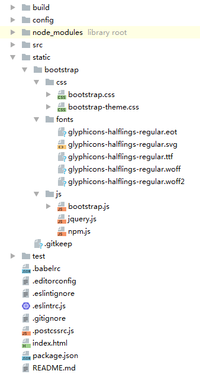

# 安装vue-cli
```
# cnpm install -g vue-cli
```

# 用vue-cli构建项目
```
# mkdir vue
# cd vue
# vue init webpack demo
```
```
	运行初始化命令的时候回让用户输入几个基本的选项，如项目名称，描述，作者等信息，如果不想填就直接回车默认。
	该命令用来初始化一个项目，webpack是构建工具，也就是整个项目是基于webpack的；demo是整个项目文件夹的名称，这个文件夹会自动生成在指定的目录vue中。
```

# 安装项目所需的依赖
```
# cd demo
# cnpm install
```
```
	安装完成之后，会在我们的项目目录firstVue文件夹中多出一个node_modules文件夹，这里边就是我们项目需要的依赖包资源。
```

# 运行项目
```
# npm run dev
```
```
	run对应的是package.json文件中scripts字段中的dev，也就是 node build/dev-server.js命令的一个快捷方式。

	运行成功后，cmd开始监听本地的8080端口,同时，浏览器会自动打开http://localhost:8080/#/（如果浏览器没有自动打开，可以手动输入）。
```

# 安装jquery
```
# cnpm install jquery --save
```

# 安装bootstrap
```
# cnpm install bootstrap --save
```

# 引入bootstrap

- 在index.html文件中加入<meta>标签实现响应式
```
<meta name="viewport" content="width=device-width, user-scalable=no, initial-scale=1.0, maximum-scale=1.0, minimum-scale=1.0">
<meta http-equiv="X-UA-Compatible" content="ie=edge">
```

- 把下载的jquery和bootstrap相关的文件复制到static目录下



- 在index.html文件中添加引用
```
<link rel="stylesheet" href="static/bootstrap/css/bootstrap.css">
<script src="static/bootstrap/js/jquery.js"></script>
<script src="static/bootstrap/js/bootstrap.js"></script>
```